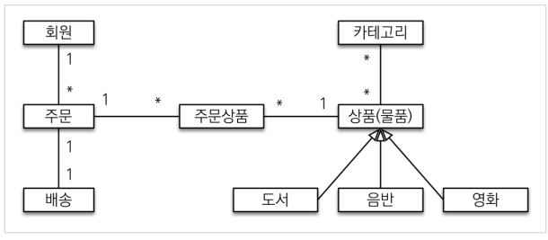
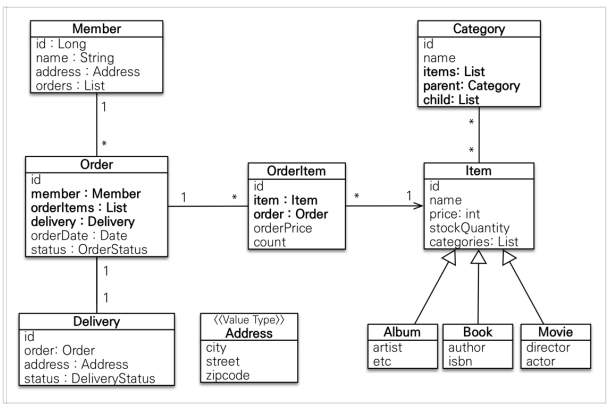

# SpringBoot2
<h2>ver.2 결제창 추가 </h2>
- 추가 기능
  - 주문 기능에 결제창, 결제완료창 추가
  - 로그인 기능 추가
  - 카테고리, 배송정보 db 추가

<h2>ver.1 회원/상품/주문 </h2>
<h3>기능 목록</h3>
- 회원 기능
  - 회원 등록
  - 회원 조회 
- 상품 기능
  - 상품 등록
  - 상품 수정
  - 상품 조회
- 주문 기능
  - 상품 주문
  - 주문 내역 조회
  - 주문 취소
- 기타 요구사항
  - 상품은 재고 관리가 필요하다.
  - 상품의 종류는 도서, 음반, 영화가 있다.
  - 상품을 카테고리로 구분할 수 있다
  - 상품 주문시 배송 정보를 입력할 수 있다
- 구현 안된 사항 및 예외 사항
  - 로그인과 권한관리
  - 파라미터 검증과 예외처리 단순화
  - 상품은 도서만 사용
  - 카테고리 db 사용 안함
  - 배송 정보 db 사용 안함

<h3>도메인 모델 & 테이블 설계</h3>

  
위의 설계는 예제를 위한 구조.
- 다대다 설계는 운영에서는 사용하면 안됨.
- 가급적이면 양방향보다 단방향 관계가 좋음.
- 회원을 통해서 주문을 생성한다고 생각하기보단, 주문 생성에 멤버가 필요하다고 생각!